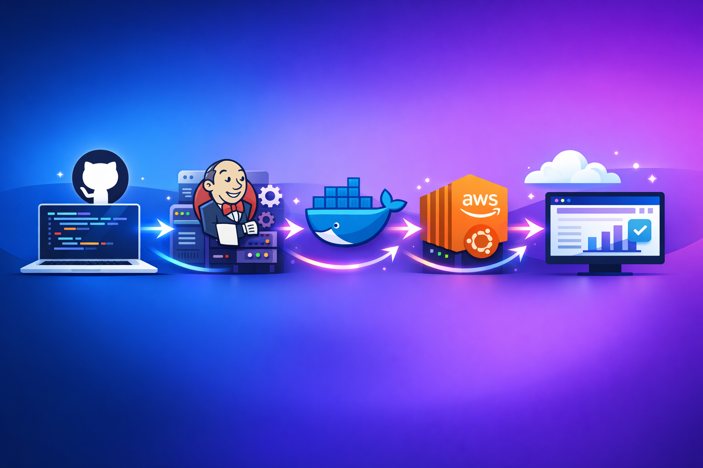
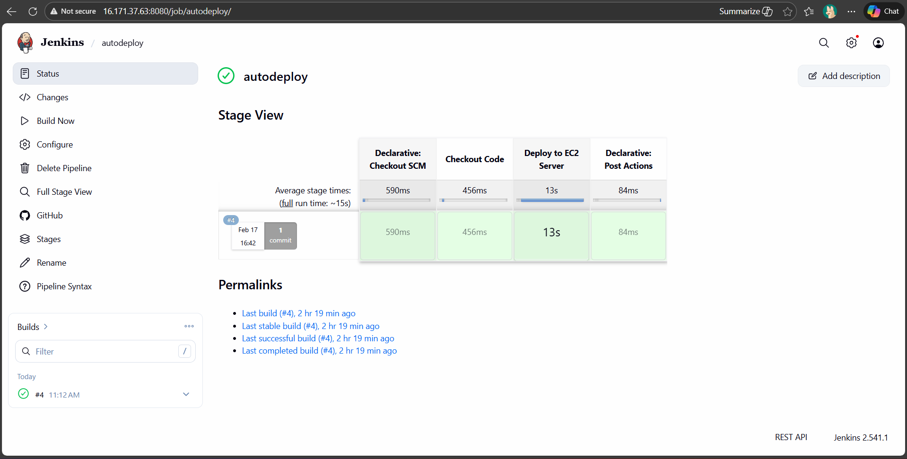

# AutoDeploy-CI-CD-Pipeline-using-Jenkins-and-Docker

A **production-style CI/CD pipeline** that automatically builds and deploys a Dockerized Python application to a **remote AWS EC2 server** using **Jenkins** and **SSH**.

This project demonstrates **real-world DevOps practices** such as automation, containerization, and remote deployment.

---

##  Project Overview

This project automates the complete deployment process:

- Jenkins pulls the latest code from GitHub
- Connects securely to a remote EC2 instance via SSH
- Builds a Docker image
- Stops the old container
- Deploys the latest container automatically

- No manual intervention  
- Fast & reliable deployments  
- Industry-standard CI/CD workflow  

---

##  Architecture

Developer
    |
    v
GitHub Repository
    |
    v
Jenkins Server (CI/CD)
    |
    v
(SSH)AWS EC2 Deployment Server
    |
    v
Docker Container (Live App)

---

## Tech Stack

- **Jenkins** – CI/CD automation  
- **Docker** – Containerization  
- **Git & GitHub** – Version control  
- **AWS EC2 (Ubuntu)** – Deployment server  
- **Python (Flask)** – Sample application  
- **Linux** – Server environment  

---

##  Project Structure

AutoDeploy-CI-CD-Pipeline/
│
├── app.py # Python Flask application
├── requirements.txt # Python dependencies
├── Dockerfile # Docker image definition
├── Jenkinsfile # CI/CD pipeline script
└── README.md # Project documentation

---

##  Jenkins Pipeline Workflow

1. **Checkout Code**  
   Jenkins pulls the latest code from GitHub.

2. **SSH Connection**  
   Jenkins connects to the remote EC2 server using SSH credentials.

3. **Build Docker Image**  
   A new Docker image is built from the updated source code.

4. **Deploy Container**  
   - Old container is stopped and removed  
   - New container is started with the latest image  

5. **Application Goes Live**   

---

## Application Access

Once the pipeline runs successfully, the application is accessible at:

http://<EC2-PUBLIC-IP>:5000

---

## ▶ How to Run the Project

### 1️⃣ Prerequisites
- Jenkins installed on a CI server
- Docker installed on deployment EC2
- SSH access configured between Jenkins and EC2
- GitHub repository with project files

---

### 2️⃣ Configure Jenkins Job
- Create a **Pipeline Job**
- Select **Pipeline script from SCM**
- Add GitHub repository URL
- Set branch to `main`
- Use `Jenkinsfile`

---

### 3️⃣ Trigger Build
- Click **Build Now**
- Or configure GitHub webhook for auto-trigger

  

---

##  Author

**Nikita Thosare**  
Cloud & DevOps Enthusiast  
IT Engineer | Jenkins | Docker | AWS  

---

If you found this project useful, give it a **star** on GitHub!
